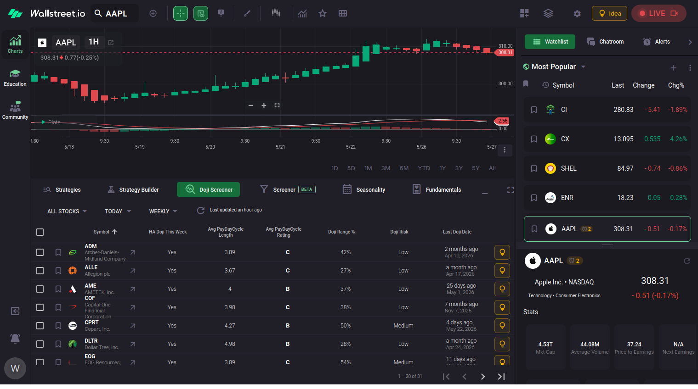

# Charts app

{ loading=lazy }

Need to add labels

## App components
* Stock Search
* Chart Area 
    * [Charting Tools](../charts-app/chart-area/1-charting-tools.md)
    * [Plot](../charts-app/chart-area/2-plot.md)
* Toolbar
    * Filter Area: The Filter Area is the top section when filters / dropdowns are located.
    * Data Area: The Data Area is the area below the Filter Area where filtered data will populate. 
    * All tools: 
        * [Doji Screener](../charts-app/toolbar/1-doji-screener.md)
        * [Screener (Beta)](../charts-app/toolbar/2-screener.md)
        * [Seasonality](../charts-app/toolbar/3-seasonality.md)
        * [Fundamentals](../charts-app/toolbar/4-fundamentals.md)
        * [Strategies](../charts-app/toolbar/5-strategies.md)
        * [Strategy Builder](../charts-app/toolbar/6-strategy-builder.md)
* Sidebar 
    * Sidebar tool selector
    * Sidebar display area
